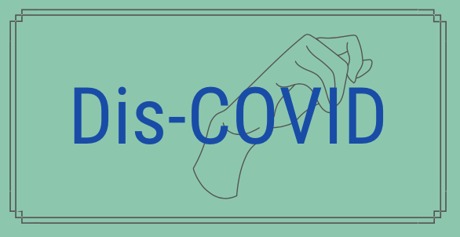

# Dis-COVID

Discover new passions and make boredom dis-appear with Dis-COVID.

## Inspiration

With COVID-19 forcing people to remain at home and social distance, boredom is affecting many individuals. Unfortunately, this is having a terrible impact on people’s mental health, with some mental health lines such as Alberta’s receiving 300% more calls a day. With mental health services struggling to keep up, many are not getting the treatment they need. 

To combat this issue, Dis-COVID was created to eliminate one of the causes of mental illness – boredom. 

## What it does

Dis-COVID provides users with a supportive community where they can discover new hobbies and pursue what they love. On the web application, users can search for a variety of hobbies (such as baking, coding, etc.) to discover what other members of the Dis-COVID community have done. Using the accomplishments of others as inspiration, users can try new activities or continue to pursue their existing hobbies. Once users complete an activity, they can share their achievements to inspire more individuals! With so much to learn and do, users will not feel bored as they continue to respect social distancing measures.

## How we built it

HTML5 and CSS3 were used to structure and style the web application. Javascript was used to integrate [Firebase](https://firebase.google.com/) into the application. To create user accounts, the authentication feature in Firebase was used. [Cloud Firestore](https://firebase.google.com/docs/firestore/) was used to store all information relating to the posts (titles, tags, images, descriptions, etc.). We implemented [Cloud Storage](https://firebase.google.com/docs/storage/) to store all uploaded images. To host the website we used [Heroku](https://www.heroku.com/what) that automatically deploys from this repository.

## Challenges we ran into

As none of our group members had any experience using Firebase, it was very difficult to implement it into our project. To familiarize ourselves with Firebase, we invested around four hours to understand how to use Firebase. During the learning process, we found [The Net Ninja](https://www.youtube.com/channel/UCW5YeuERMmlnqo4oq8vwUpg) very helpful. 

Another challenge we faced was the implementation of Firebase authentication because the API was not working when we followed online sources. With self-experimentation, we found that separating signing in, logging off, and logging on into different Javascript files solved the problem. 

Another difficult challenge we ran into was linking pictures stored in Cloud Storage to posts stored in Cloud Firestore so when a post is displayed, the correct picture is displayed as well. Geoffrey took on this challenge and discovered how to store the Firebase image URL of an image into a post document in Cloud Firestore, resolving the issue.

## Accomplishments that we're proud of

We are proud that we created Dis-COVID in a short amount of time. Additionally, we are happy that we overcame all issues and implemented Firebase to combat deteriorating mental health in populations. Moreover, for many individuals on our team, this was their first time coding in Javascript, so we are proud to see that they quickly learned and applied the language. 

## What we learned

This was the first time that all of us have integrated Firebase into a user-friendly platform. As a result, we learned a lot about the Firebase console, Firebase products such as Cloud Storage and Cloud Firestore, initializing firebase products in a project, and the associated API keys.

## What's next for Dis-COVID

## Contributions
This product was made for GeomHacks 2020 between June 13th and 14th. 

Contributors to this project:
- Alayna Nguyen: https://github.com/alaynamnguyen
- Geoffrey Wu: https://github.com/thedoge42
- William Zhang: https://github.com/Phytal
- Dhruv Rawat (owner of this repository): https://github.com/Pop0097
